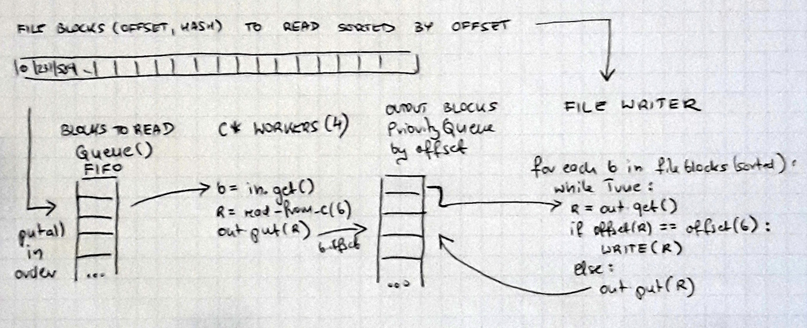

# CASStor - scalable storage with deduplication on C*

## Introduction
I would like to show that implementing scalable cloud storage with hash based block deduplication
is quite easy nowadays using existing tools such Cassandra and Spark.

My goal was to prototype storage with following features:

1. It can store or restore files
2. Implements block deduplication
3. Scales horizontally with more storage / performance demand
4. Keeps configurable number of block copies
5. Space reclamation (removal of unused blocks) can be performed in a “cleanup” time (no writes accepted)

The limitation of having read-only period for cleaning up is important
as implementing read-write space reclamation of unused blocks is a complex distributed task far beyond this prototype.

### Block deduplication
Basic idea is that each file stored in our system is divided into chunks of limited size.
As we use smart chunking algorithm (rabin fingerprinting) we assume that some files can share chunks.
For each chunk system calculates hash (as identifier) and if it is already present in our storage
it is reused by multiple stored files.
Read more at: https://pibytes.wordpress.com/2013/02/02/deduplication-internals-part-1/

### Scaling and configuration
Scaling is the ability to add new nodes to the cluster to increase storage or performance.
Number of copies of metadata and data can be configured per system.
Each file and block has same number of copies.

### Space reclamation
When files are removed blocks of it are not used anymore.
But same block (chunks) can be used by other files.
So it is essential to safely remove blocks that are not used anymore at all.

### Why Cassandra?
I have decided for Apache Cassandra for following reasons:

1. It is scalable and has configurable number of copies / consistency
2. t is open source and easy to use

## Running Cassandra

For development and functional testing it is enoough to run cassandra on local machine using ccm (https://github.com/pcmanus/ccm).  This tool let you easily create and manage a multi-node cluster, start stop nodes, run cqlsh etc.

```bash
ccm create test -v 3.7.0 -n 3 -s  # create a 3 nodes cluster test with C* version 3.7.0 `
ccm status  # print cluster status
ccm node1 cqlsh  # run cqlsh on node1
ccm add node4 -i 127.0.0.4 -j 7400 -b  # add node to the cluster
ccm start node1  # start newly added node
```
## Data model

All the data of files stored in CASStor are kept in the Cassandra database. We need to store individual blocks (chunks) and how files are composed suing those blocks. 
We need to manage resiliency in case of a hdd or node failure.

### Resiliency

Cassandra keeps data with configurable resiliency using different replication strategies.
Strategy is configured per *keyspace*.
By configuring keyspaces differently we can achieve different goals.

First of all it may be reasonable to keep data (blocks) and metadata (files) in different keyspaces:

1. we may need to keep different number of copies as the size of data is different or to speed up some operations
2. We may want to configure caches (row, key, etc.) differently for data and metadata
3. we may want to perform maintenance on data and metadata separately e.g. repair or calculate amount of data

So lets create two keyspaces to keep 3 replicas of metadata and 2 of data
```
create keyspace casstor_data with replication = {'class': 'SimpleStrategy', 'replication_factor': 3};
create keyspace casstor_meta with replication = {'class': 'SimpleStrategy', 'replication_factor': 2};
```
Now let's say we want to be super resilient and have 2 different data centers in separate locations.
We can ask Cassandra to keep 2 copies in local DC and 1 in remote:
```
create keyspace casstor_data with replication = {'class': 'NetworkTopologyStrategy', 'MAINDC': 3, 'BACKUPDC': 1};
create keyspace casstor_meta with replication = {'class': 'NetworkTopologyStrategy', 'MAINDC': 2, 'BACKUPDC': 1};
```

### Files
We need to describe files we keep in the storage. Each file consists of a list of blocks ordered by its offsets:
```sql
create table files( path text, block_offset bigint,
    block_hash text, block_size int,
    primary key (path, block_offset) );
```
Design decisions:

1. We do not keep separate list of files, it is enough to assume file is present if it has at least one block
2. Primary key (path, block_offset) identifies block in file at offset
3. Partition key path assures that all blocks of the file are within same partition and can be retrieved from 1 cassandra node
4. Clustering key block_offset assures that blocks are organized by offset within the file so we can read them in a good sequence even if we write them in random order
5. At each offset we keep hash of the block and it’s size (mostly for verification)

### Blocks

We have to keep blocks (chunks) and be able to easily find requested block by its ID.
```sql
create table blocks(block_hash text, block_size int, content blob,
primary key(block_hash, block_size));
```
Design decisions:

1. Blocks are identified by its hash.
2. Primary key consists of block_hash and block_size
3. At the moment there is no important reason to keep block_size as clustering key
4. C\* partitioner should deal correctly with partition key being already a hash

## Store / Restore Operations

### Write file (store)
```
client.py read {source} {casstor_file_id}
```
The goal of write is to read source file from local filesystem and write it into CASSTOR under casstor_file_id identifier.

Let's start with simple, sequential implementation:

```
chunk source file to list of blocks with (offset, size)
blocks = []
for each chunk:
block = read_chunk(source_file, chunk.size)
H = calculate_hash(block)
If not exist in C* (H):
	cassandra: add (H,b) to blocks table
blocks.append(chunk.offset, H)
cassandra: delete from files where path = destination
for each block in blocks:
	cassandra: add (destination, offset, H) to files table
```
Above implementation has some major performance drawbacks:

* source file is read twice: once for chunking and then for storing data
* cassandra operations can be parallelized to boost performance as the database can handle multiple concurrent writes

#### Chunking
The goal of chunking is to divide file into parts using rabin fingerint (https://en.wikipedia.org/wiki/Rabin_fingerprint) based on file content in the way, that if similar chunks exists in different files  they will be recognized. It takes source file as input and return a list of pairs (offset, size).  

Interesting feature of this algorithm is that there is some average but also maximum block size which let limit amount of memory used during processing data.

I found two libraries for python

* https://github.com/aitjcize/pyrabin
* https://github.com/cschwede/python-rabin-fingerprint

Decided to use (2) as slightly faster.

#### Hashing
For each block we need to calculate hash in the way that the possibility of collision (two blocks having different content will have exactly same hash) is very low. And we need this function to be fast.

I decided to use BLAKE2 (https://en.wikipedia.org/wiki/BLAKE_(hash_function)#BLAKE2)  algorithm mostly because I have not used it before.There is an implementation in python for this algorithm: https://pythonhosted.org/pyblake2/

More reading: https://en.wikipedia.org/wiki/Cryptographic_hash_function#Cryptographic_hash_algorithms

### Read file (restore)
```sql
client.py read {casstor_file_id} {destination_path}
```
Restoring the file from CASSTOR is the operation that takes file blocks from storage and write them to destination file in proper order.

Sequential operation is quite obvious:
```
file_blocks = cassandra: select * from files where path = casstor_file_id order by block_offset;
for each block in file_blocks:
    r = cassandra: select content from blocks where block_hash = block.hash
    write_block(destination_file, r)
```
Similar o write this implementation also has performance drawbacks as blcok retrievel from Cassandra database can be use different cluster nodes (with proper partitioning) and thus should be parallelized. We will get to it later.

## Implementation with concurrent C* workers

We expect C* to be a cluster with multiple nodes it makes sense to run multiple C* operations concurrent with multiple workers.

To store the file we need to check or store multiple objects in cassandra.
For restore - we need to restore multiple blocks and then sequentially write them to the output file.

### Write with N cassandra writers

We will need N workers and a queue with limited size to keep blocks read from the source file.

* Each worker will get block from the queue and store in C*.
* File reader will read subsequent chunks from source file and put into the queue.
* By limiting queue size we can control amount of memory streamed from the source file.


The code is here: https://github.com/tlasica/casstor/blob/master/client.py#L121-L147

### Read with concurrent C* workers
We need to restore blocks and write them to destination file in a correct offset sequence.
The problem is that even if we schedule multiple block reads in the offset order with multiple workers we cannot assume that they will be returned in the offset order. This max implementation more complex.

* We read all the required blocks offsets and hashes and put them into FIFO queue (this is only metadata)
* Output is a PriorityQueue() prioritized by offset to write data in a right order
* Each worker get (offset,hash) from the queue, reads block from C* and put into output queue
* FileWriter expects file blocks from the FIFO queue one by one and reads from the priority queue. If it is a block with expected output - writes it to the destination file, in other case puts the block back to the priority queue



This solution has two major drawbacks:

1. It can completely block if expected block cannot be read
2. It can grow the memory usage when one block read is delayed in the worker but other blocks (next ones) are read and put into the output priority queue

Code for cassandra workers: https://github.com/tlasica/casstor/blob/master/client.py#L78-L99

and code for file writer: https://github.com/tlasica/casstor/blob/master/client.py#L175-L207

To solve above a supervision strategy is required to retry block read after timeout or break the process in such case. It is quite difficult to implement in python prototype, in the production I would probably use [Akka](akka.io).

## Performance results and optimizations

For this experiment I used 3 nodes cluster on openstack and additional openstack node serving as a client.
Both cluster and client are in the same openstack network. Each cluster node has 8G RAM and 4 VPU.
Cassandra is using default configuration.

|Test|Throughput|Comments|
|----|----------:|--------|
|new block writes|25 MB/s||
|duplicate writes|37 MB/s|Seems like there is an overhead on each C* op|
|restore|40 MB/s||

Interesting is that difference between duplicates and non-duplicate writes is not that large.


### Can network be a problem?

Seems the network is not a problem:
```
iperf -c 10.200.176.5
------------------------------------------------------------
Client connecting to 10.200.176.5, TCP port 5001
TCP window size: 85.0 KByte (default)
------------------------------------------------------------
[  3] local 10.200.181.123 port 51841 connected with 10.200.176.5 port 5001
[ ID] Interval       Transfer     Bandwidth
[  3]  0.0-10.0 sec  7.13 GBytes  6.12 Gbits/sec
```

### Read optimization by reading N rows in one query

To restore the file from storage is is required to read every single block.
Even with multiple C* workers each of them is asking for only one relatively small block.
I suspect there is significant overhead with query handling.
Simple solution was to ask for N blocks in one query using `IN (...)` clause.
```python
prep_q = self.session.prepare('select block_hash, content from blocks where block_hash in (?,?,?,?,?);')
hash_list = [t.hash for t in tasks]
hash_list = (hash_list + ['0'] * batch_size)[:batch_size]  # trick to fill list with 0s
out = session.execute(prep_q, hash_list)
```

Improvement is significant: from 40 MB/s to 58 MB/s.

The solution is not elegant with hardcoded batch size but it is not possible to batch selects :-) 

### Minor gains with using LIMIT

If the code expects up to N rows then it may benefit to limit the result using `LIMIT n` clause:

* in store() operation for checking block existance
* in restore() operation for retrieving blocks 

|Test|Throughput|Comments|
|----|----------:|--------|
|new block writes|26 MB/s|small gain|
|duplicate writes|43 MB/s|gain from 40 MB/s|
|restore|61 MB/s|gain from 58 MB/s|

The reason why is not obvious, so let's check query plans.
To see the difference let's insert blocks with hashes: a,b,c,d,e.
```sql
qlsh> select block_hash from dedup.blocks where block_hash in ('a','b','c','d','e') limit 5;

 block_hash
------------
          a
          b
          c
          d
          e

(5 rows)

Tracing session: e8d195c0-8ef5-11e6-82b1-d3d302e39b20

 activity                                                                                                             | timestamp                  | source        | source_elapsed
----------------------------------------------------------------------------------------------------------------------+----------------------------+---------------+----------------
                                                                                                   Execute CQL3 query | 2016-10-10 14:29:10.556000 |  10.200.176.5 |              0
                                   READ message received from /10.200.176.5 [MessagingService-Incoming-/10.200.176.5] | 2016-10-10 14:29:07.764000 | 10.200.176.51 |             25
                                   READ message received from /10.200.176.5 [MessagingService-Incoming-/10.200.176.5] | 2016-10-10 14:29:07.765000 | 10.200.176.51 |            140
                                   READ message received from /10.200.176.5 [MessagingService-Incoming-/10.200.176.5] | 2016-10-10 14:29:07.765000 | 10.200.176.51 |            179
                                   READ message received from /10.200.176.5 [MessagingService-Incoming-/10.200.176.5] | 2016-10-10 14:29:07.765000 | 10.200.176.51 |            217
                                                     Executing single-partition query on blocks [SharedPool-Worker-1] | 2016-10-10 14:29:07.765000 | 10.200.176.51 |            238
                                                                   Acquiring sstable references [SharedPool-Worker-1] | 2016-10-10 14:29:07.765000 | 10.200.176.51 |            289
                                                                      Merging memtable contents [SharedPool-Worker-1] | 2016-10-10 14:29:07.765000 | 10.200.176.51 |            311
                                                              Read 1 live and 1 tombstone cells [SharedPool-Worker-1] | 2016-10-10 14:29:07.765001 | 10.200.176.51 |            449
                                                     Executing single-partition query on blocks [SharedPool-Worker-2] | 2016-10-10 14:29:07.765001 | 10.200.176.51 |            464
                                                                   Acquiring sstable references [SharedPool-Worker-2] | 2016-10-10 14:29:07.765001 | 10.200.176.51 |            489
                                                            Enqueuing response to /10.200.176.5 [SharedPool-Worker-1] | 2016-10-10 14:29:07.765001 | 10.200.176.51 |            496
                                                                      Merging memtable contents [SharedPool-Worker-2] | 2016-10-10 14:29:07.765001 | 10.200.176.51 |            504
                                                     Executing single-partition query on blocks [SharedPool-Worker-4] | 2016-10-10 14:29:07.765001 | 10.200.176.51 |            581
                                                              Read 1 live and 1 tombstone cells [SharedPool-Worker-2] | 2016-10-10 14:29:07.765001 | 10.200.176.51 |            602
                                                                   Acquiring sstable references [SharedPool-Worker-4] | 2016-10-10 14:29:07.765001 | 10.200.176.51 |            626
                                                            Enqueuing response to /10.200.176.5 [SharedPool-Worker-2] | 2016-10-10 14:29:07.765001 | 10.200.176.51 |            636
                                                                      Merging memtable contents [SharedPool-Worker-4] | 2016-10-10 14:29:07.765002 | 10.200.176.51 |            647
                                                              Read 1 live and 1 tombstone cells [SharedPool-Worker-4] | 2016-10-10 14:29:07.765002 | 10.200.176.51 |            731
                                                            Enqueuing response to /10.200.176.5 [SharedPool-Worker-4] | 2016-10-10 14:29:07.765002 | 10.200.176.51 |            763
                          Sending REQUEST_RESPONSE message to /10.200.176.5 [MessagingService-Outgoing-/10.200.176.5] | 2016-10-10 14:29:07.765002 | 10.200.176.51 |            872
                                                     Executing single-partition query on blocks [SharedPool-Worker-3] | 2016-10-10 14:29:07.766000 | 10.200.176.51 |           1110
                                                                   Acquiring sstable references [SharedPool-Worker-3] | 2016-10-10 14:29:07.766000 | 10.200.176.51 |           1135
                                                                      Merging memtable contents [SharedPool-Worker-3] | 2016-10-10 14:29:07.766000 | 10.200.176.51 |           1147
                                                              Read 1 live and 1 tombstone cells [SharedPool-Worker-3] | 2016-10-10 14:29:07.766001 | 10.200.176.51 |           1244
                                                            Enqueuing response to /10.200.176.5 [SharedPool-Worker-3] | 2016-10-10 14:29:07.766001 | 10.200.176.51 |           1286
                          Sending REQUEST_RESPONSE message to /10.200.176.5 [MessagingService-Outgoing-/10.200.176.5] | 2016-10-10 14:29:07.770000 | 10.200.176.51 |           5154
                          Sending REQUEST_RESPONSE message to /10.200.176.5 [MessagingService-Outgoing-/10.200.176.5] | 2016-10-10 14:29:07.771000 | 10.200.176.51 |           6686
                          Sending REQUEST_RESPONSE message to /10.200.176.5 [MessagingService-Outgoing-/10.200.176.5] | 2016-10-10 14:29:07.772000 | 10.200.176.51 |           7247
 Parsing select block_hash from dedup.blocks where block_hash in ('a','b','c','d','e') limit 5; [SharedPool-Worker-1] | 2016-10-10 14:29:10.557000 |  10.200.176.5 |            216
                                                                            Preparing statement [SharedPool-Worker-1] | 2016-10-10 14:29:10.557000 |  10.200.176.5 |            350
                                                               reading data from /10.200.176.51 [SharedPool-Worker-1] | 2016-10-10 14:29:10.557000 |  10.200.176.5 |            614
                                                               reading data from /10.200.176.51 [SharedPool-Worker-1] | 2016-10-10 14:29:10.557000 |  10.200.176.5 |            681
                                                               reading data from /10.200.176.51 [SharedPool-Worker-1] | 2016-10-10 14:29:10.557000 |  10.200.176.5 |            767
                                                               reading data from /10.200.176.51 [SharedPool-Worker-1] | 2016-10-10 14:29:10.557001 |  10.200.176.5 |            800
                                                     Executing single-partition query on blocks [SharedPool-Worker-2] | 2016-10-10 14:29:10.557001 |  10.200.176.5 |            807
                                                                   Acquiring sstable references [SharedPool-Worker-2] | 2016-10-10 14:29:10.557001 |  10.200.176.5 |            855
                                                                      Merging memtable contents [SharedPool-Worker-2] | 2016-10-10 14:29:10.557001 |  10.200.176.5 |            924
                                    Sending READ message to /10.200.176.51 [MessagingService-Outgoing-/10.200.176.51] | 2016-10-10 14:29:10.557001 |  10.200.176.5 |            982
                                    Sending READ message to /10.200.176.51 [MessagingService-Outgoing-/10.200.176.51] | 2016-10-10 14:29:10.557001 |  10.200.176.5 |           1047
                                    Sending READ message to /10.200.176.51 [MessagingService-Outgoing-/10.200.176.51] | 2016-10-10 14:29:10.557001 |  10.200.176.5 |           1085
                                                              Read 1 live and 1 tombstone cells [SharedPool-Worker-2] | 2016-10-10 14:29:10.558000 |  10.200.176.5 |           1140
                                    Sending READ message to /10.200.176.51 [MessagingService-Outgoing-/10.200.176.51] | 2016-10-10 14:29:10.558000 |  10.200.176.5 |           1175
                     REQUEST_RESPONSE message received from /10.200.176.51 [MessagingService-Incoming-/10.200.176.51] | 2016-10-10 14:29:10.566000 |  10.200.176.5 |           9647
                                                        Processing response from /10.200.176.51 [SharedPool-Worker-2] | 2016-10-10 14:29:10.566000 |  10.200.176.5 |           9726
                     REQUEST_RESPONSE message received from /10.200.176.51 [MessagingService-Incoming-/10.200.176.51] | 2016-10-10 14:29:10.566000 |  10.200.176.5 |           9703
                     REQUEST_RESPONSE message received from /10.200.176.51 [MessagingService-Incoming-/10.200.176.51] | 2016-10-10 14:29:10.566000 |  10.200.176.5 |           9782
                     REQUEST_RESPONSE message received from /10.200.176.51 [MessagingService-Incoming-/10.200.176.51] | 2016-10-10 14:29:10.566000 |  10.200.176.5 |           9826
                                                        Processing response from /10.200.176.51 [SharedPool-Worker-3] | 2016-10-10 14:29:10.566000 |  10.200.176.5 |           9826
                                                        Processing response from /10.200.176.51 [SharedPool-Worker-3] | 2016-10-10 14:29:10.566001 |  10.200.176.5 |           9908
                                                        Processing response from /10.200.176.51 [SharedPool-Worker-3] | 2016-10-10 14:29:10.566001 |  10.200.176.5 |           9959
                                                                                                     Request complete | 2016-10-10 14:29:10.566391 |  10.200.176.5 |          10391


cqlsh> select block_hash from dedup.blocks where block_hash in ('a','b','c','d','e');

 block_hash
------------
          a
          b
          c
          d
          e

(5 rows)

Tracing session: eae9ee70-8ef5-11e6-82b1-d3d302e39b20

 activity                                                                                                     | timestamp                  | source        | source_elapsed
--------------------------------------------------------------------------------------------------------------+----------------------------+---------------+----------------
                                                                                           Execute CQL3 query | 2016-10-10 14:29:14.072000 |  10.200.176.5 |              0
                           READ message received from /10.200.176.5 [MessagingService-Incoming-/10.200.176.5] | 2016-10-10 14:29:11.279000 | 10.200.176.51 |            238
                                             Executing single-partition query on blocks [SharedPool-Worker-1] | 2016-10-10 14:29:11.280000 | 10.200.176.51 |            375
                                                           Acquiring sstable references [SharedPool-Worker-1] | 2016-10-10 14:29:11.280000 | 10.200.176.51 |            433
                                                              Merging memtable contents [SharedPool-Worker-1] | 2016-10-10 14:29:11.280000 | 10.200.176.51 |            458
                                                      Read 1 live and 1 tombstone cells [SharedPool-Worker-1] | 2016-10-10 14:29:11.280000 | 10.200.176.51 |            632
                                                    Enqueuing response to /10.200.176.5 [SharedPool-Worker-1] | 2016-10-10 14:29:11.280000 | 10.200.176.51 |            679
                  Sending REQUEST_RESPONSE message to /10.200.176.5 [MessagingService-Outgoing-/10.200.176.5] | 2016-10-10 14:29:11.280000 | 10.200.176.51 |            934
                           READ message received from /10.200.176.5 [MessagingService-Incoming-/10.200.176.5] | 2016-10-10 14:29:11.293000 | 10.200.176.51 |             10
                                             Executing single-partition query on blocks [SharedPool-Worker-4] | 2016-10-10 14:29:11.295000 | 10.200.176.51 |           2325
                                                           Acquiring sstable references [SharedPool-Worker-4] | 2016-10-10 14:29:11.295000 | 10.200.176.51 |           2441
                                                              Merging memtable contents [SharedPool-Worker-4] | 2016-10-10 14:29:11.295000 | 10.200.176.51 |           2464
                                                      Read 1 live and 1 tombstone cells [SharedPool-Worker-4] | 2016-10-10 14:29:11.296000 | 10.200.176.51 |           2992
                                                    Enqueuing response to /10.200.176.5 [SharedPool-Worker-4] | 2016-10-10 14:29:11.296000 | 10.200.176.51 |           3115
                  Sending REQUEST_RESPONSE message to /10.200.176.5 [MessagingService-Outgoing-/10.200.176.5] | 2016-10-10 14:29:11.296000 | 10.200.176.51 |           3389
                           READ message received from /10.200.176.5 [MessagingService-Incoming-/10.200.176.5] | 2016-10-10 14:29:11.298000 | 10.200.176.51 |             25
                                             Executing single-partition query on blocks [SharedPool-Worker-7] | 2016-10-10 14:29:11.298000 | 10.200.176.51 |             81
                                                           Acquiring sstable references [SharedPool-Worker-7] | 2016-10-10 14:29:11.298000 | 10.200.176.51 |            103
                                                              Merging memtable contents [SharedPool-Worker-7] | 2016-10-10 14:29:11.298000 | 10.200.176.51 |            123
                                                      Read 1 live and 1 tombstone cells [SharedPool-Worker-7] | 2016-10-10 14:29:11.298000 | 10.200.176.51 |            211
                                                    Enqueuing response to /10.200.176.5 [SharedPool-Worker-7] | 2016-10-10 14:29:11.298000 | 10.200.176.51 |            243
                  Sending REQUEST_RESPONSE message to /10.200.176.5 [MessagingService-Outgoing-/10.200.176.5] | 2016-10-10 14:29:11.299000 | 10.200.176.51 |           1250
                           READ message received from /10.200.176.5 [MessagingService-Incoming-/10.200.176.5] | 2016-10-10 14:29:11.301000 | 10.200.176.51 |             57
                                             Executing single-partition query on blocks [SharedPool-Worker-6] | 2016-10-10 14:29:11.302000 | 10.200.176.51 |            146
                                                           Acquiring sstable references [SharedPool-Worker-6] | 2016-10-10 14:29:11.302000 | 10.200.176.51 |            191
                                                              Merging memtable contents [SharedPool-Worker-6] | 2016-10-10 14:29:11.302000 | 10.200.176.51 |            209
                                                      Read 1 live and 1 tombstone cells [SharedPool-Worker-6] | 2016-10-10 14:29:11.302000 | 10.200.176.51 |            283
                                                    Enqueuing response to /10.200.176.5 [SharedPool-Worker-6] | 2016-10-10 14:29:11.302000 | 10.200.176.51 |            315
                  Sending REQUEST_RESPONSE message to /10.200.176.5 [MessagingService-Outgoing-/10.200.176.5] | 2016-10-10 14:29:11.302000 | 10.200.176.51 |            835
 Parsing select block_hash from dedup.blocks where block_hash in ('a','b','c','d','e'); [SharedPool-Worker-1] | 2016-10-10 14:29:14.072000 |  10.200.176.5 |            262
                                                                    Preparing statement [SharedPool-Worker-1] | 2016-10-10 14:29:14.072000 |  10.200.176.5 |            450
                                                       reading data from /10.200.176.51 [SharedPool-Worker-1] | 2016-10-10 14:29:14.072001 |  10.200.176.5 |            738
                            Sending READ message to /10.200.176.51 [MessagingService-Outgoing-/10.200.176.51] | 2016-10-10 14:29:14.073000 |  10.200.176.5 |           1104
             REQUEST_RESPONSE message received from /10.200.176.51 [MessagingService-Incoming-/10.200.176.51] | 2016-10-10 14:29:14.079000 |  10.200.176.5 |           7429
                                                Processing response from /10.200.176.51 [SharedPool-Worker-4] | 2016-10-10 14:29:14.079000 |  10.200.176.5 |           7776
                                                                   Read-repair DC_LOCAL [SharedPool-Worker-1] | 2016-10-10 14:29:14.080000 |  10.200.176.5 |           8448
                                                       reading data from /10.200.176.50 [SharedPool-Worker-1] | 2016-10-10 14:29:14.080000 |  10.200.176.5 |           8557
                                             Executing single-partition query on blocks [SharedPool-Worker-8] | 2016-10-10 14:29:14.080000 |  10.200.176.5 |           8766
                            Sending READ message to /10.200.176.50 [MessagingService-Outgoing-/10.200.176.50] | 2016-10-10 14:29:14.080000 |  10.200.176.5 |           8795
                                                           Acquiring sstable references [SharedPool-Worker-8] | 2016-10-10 14:29:14.080000 |  10.200.176.5 |           8818
                                                              Merging memtable contents [SharedPool-Worker-8] | 2016-10-10 14:29:14.080000 |  10.200.176.5 |           8858
                                                      Read 1 live and 1 tombstone cells [SharedPool-Worker-8] | 2016-10-10 14:29:14.081000 |  10.200.176.5 |           9058
                                                                   Read-repair DC_LOCAL [SharedPool-Worker-1] | 2016-10-10 14:29:14.081000 |  10.200.176.5 |           9216
                                                       reading data from /10.200.176.51 [SharedPool-Worker-1] | 2016-10-10 14:29:14.081000 |  10.200.176.5 |           9282
                           READ message received from /10.200.176.5 [MessagingService-Incoming-/10.200.176.5] | 2016-10-10 14:29:14.083000 | 10.200.176.50 |             30
                                             Executing single-partition query on blocks [SharedPool-Worker-1] | 2016-10-10 14:29:14.083000 | 10.200.176.50 |            430
                                                           Acquiring sstable references [SharedPool-Worker-1] | 2016-10-10 14:29:14.083000 | 10.200.176.50 |            510
                                                              Merging memtable contents [SharedPool-Worker-1] | 2016-10-10 14:29:14.083000 | 10.200.176.50 |            541
                                                      Read 1 live and 1 tombstone cells [SharedPool-Worker-1] | 2016-10-10 14:29:14.084000 | 10.200.176.50 |            963
                                                    Enqueuing response to /10.200.176.5 [SharedPool-Worker-1] | 2016-10-10 14:29:14.084000 | 10.200.176.50 |           1017
                  Sending REQUEST_RESPONSE message to /10.200.176.5 [MessagingService-Outgoing-/10.200.176.5] | 2016-10-10 14:29:14.084000 | 10.200.176.50 |           1187
                                                       reading data from /10.200.176.50 [SharedPool-Worker-1] | 2016-10-10 14:29:14.086000 |  10.200.176.5 |          14545
                            Sending READ message to /10.200.176.50 [MessagingService-Outgoing-/10.200.176.50] | 2016-10-10 14:29:14.086000 |  10.200.176.5 |          14704
                            Sending READ message to /10.200.176.51 [MessagingService-Outgoing-/10.200.176.51] | 2016-10-10 14:29:14.086000 |  10.200.176.5 |          14864
                           READ message received from /10.200.176.5 [MessagingService-Incoming-/10.200.176.5] | 2016-10-10 14:29:14.089000 | 10.200.176.50 |           5667
                                             Executing single-partition query on blocks [SharedPool-Worker-1] | 2016-10-10 14:29:14.089000 | 10.200.176.50 |           5793
                                                           Acquiring sstable references [SharedPool-Worker-1] | 2016-10-10 14:29:14.089000 | 10.200.176.50 |           5838
                                                              Merging memtable contents [SharedPool-Worker-1] | 2016-10-10 14:29:14.089000 | 10.200.176.50 |           5858
                                                      Read 1 live and 1 tombstone cells [SharedPool-Worker-1] | 2016-10-10 14:29:14.089000 | 10.200.176.50 |           5996
                                                    Enqueuing response to /10.200.176.5 [SharedPool-Worker-1] | 2016-10-10 14:29:14.089000 | 10.200.176.50 |           6032
             REQUEST_RESPONSE message received from /10.200.176.50 [MessagingService-Incoming-/10.200.176.50] | 2016-10-10 14:29:14.090000 |  10.200.176.5 |          18773
                                                Processing response from /10.200.176.50 [SharedPool-Worker-3] | 2016-10-10 14:29:14.091000 |  10.200.176.5 |          19046
                                                                 Initiating read-repair [SharedPool-Worker-3] | 2016-10-10 14:29:14.091000 |  10.200.176.5 |          19113
             REQUEST_RESPONSE message received from /10.200.176.51 [MessagingService-Incoming-/10.200.176.51] | 2016-10-10 14:29:14.091000 |  10.200.176.5 |          19439
                                                Processing response from /10.200.176.51 [SharedPool-Worker-6] | 2016-10-10 14:29:14.091000 |  10.200.176.5 |          19777
                                                       reading data from /10.200.176.51 [SharedPool-Worker-1] | 2016-10-10 14:29:14.092000 |  10.200.176.5 |          19988
                  Sending REQUEST_RESPONSE message to /10.200.176.5 [MessagingService-Outgoing-/10.200.176.5] | 2016-10-10 14:29:14.092000 | 10.200.176.50 |           9309
                            Sending READ message to /10.200.176.51 [MessagingService-Outgoing-/10.200.176.51] | 2016-10-10 14:29:14.092000 |  10.200.176.5 |          20120
             REQUEST_RESPONSE message received from /10.200.176.51 [MessagingService-Incoming-/10.200.176.51] | 2016-10-10 14:29:14.094000 |  10.200.176.5 |          22839
                                                Processing response from /10.200.176.51 [SharedPool-Worker-8] | 2016-10-10 14:29:14.094000 |  10.200.176.5 |          22935
                                                       reading data from /10.200.176.51 [SharedPool-Worker-1] | 2016-10-10 14:29:14.095000 |  10.200.176.5 |          23129
                            Sending READ message to /10.200.176.51 [MessagingService-Outgoing-/10.200.176.51] | 2016-10-10 14:29:14.095000 |  10.200.176.5 |          23415
             REQUEST_RESPONSE message received from /10.200.176.50 [MessagingService-Incoming-/10.200.176.50] | 2016-10-10 14:29:14.096000 |  10.200.176.5 |          24777
             REQUEST_RESPONSE message received from /10.200.176.51 [MessagingService-Incoming-/10.200.176.51] | 2016-10-10 14:29:14.097000 |  10.200.176.5 |          25743
                                               Processing response from /10.200.176.50 [SharedPool-Worker-11] | 2016-10-10 14:29:14.097000 |  10.200.176.5 |          25882
                                                                Initiating read-repair [SharedPool-Worker-11] | 2016-10-10 14:29:14.097000 |  10.200.176.5 |          25950
                                                Processing response from /10.200.176.51 [SharedPool-Worker-4] | 2016-10-10 14:29:14.098000 |  10.200.176.5 |          26342
                                                                                             Request complete | 2016-10-10 14:29:14.098555 |  10.200.176.5 |          26555
```


## Caveat found during implementation

## Summary

### Next steps
