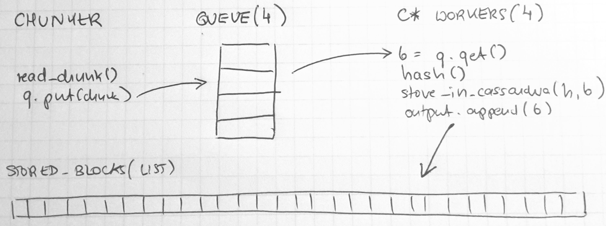

# CASStor - scalable storage with deduplication on C*

## Introduction
I would like to show that implementing scalable cloud storage with hash based block deduplication
is quite easy nowadays using existing tools such Cassandra and Spark.

My goal was to prototype storage with following features:

1. It can store or restore files
2. Implements block deduplication
3. Scales horizontally with more storage / performance demand
4. Keeps configurable number of block copies
5. Space reclamation (removal of unused blocks) can be performed in a “cleanup” time (no writes accepted)

The limitation of having read-only period for cleaning up is important
as implementing read-write space reclamation of unused blocks is a complex distributed task far beyond this prototype.

### Block deduplication
Basic idea is that each file stored in our system is divided into chunks of limited size.
As we use smart chunking algorithm (rabin fingerprinting) we assume that some files can share chunks.
For each chunk system calculates hash (as identifier) and if it is already present in our storage
it is reused by multiple stored files.
Read more at: https://pibytes.wordpress.com/2013/02/02/deduplication-internals-part-1/

### Scaling and configuration
Scaling is the ability to add new nodes to the cluster to increase storage or performance.
Number of copies of metadata and data can be configured per system.
Each file and block has same number of copies.

### Space reclamation
When files are removed blocks of it are not used anymore.
But same block (chunks) can be used by other files.
So it is essential to safely remove blocks that are not used anymore at all.

### Why Cassandra?
I have decided for Apache Cassandra for following reasons:

1. It is scalable and has configurable number of copies / consistency
2. t is open source and easy to use

## Running Cassandra

For development and functional testing it is enoough to run cassandra on local machine using ccm (https://github.com/pcmanus/ccm).  This tool let you easily create and manage a multi-node cluster, start stop nodes, run cqlsh etc.

```bash
ccm create test -v 3.7.0 -n 3 -s  # create a 3 nodes cluster test with C* version 3.7.0 `
ccm status  # print cluster status
ccm node1 cqlsh  # run cqlsh on node1
ccm add node4 -i 127.0.0.4 -j 7400 -b  # add node to the cluster
ccm start node1  # start newly added node
```
## Data model

All the data of files stored in CASStor are kept in the Cassandra database. We need to store individual blocks (chunks) and how files are composed suing those blocks. 
We need to manage resiliency in case of a hdd or node failure.

### Resiliency

Cassandra keeps data with configurable resiliency using different replication strategies.
Strategy is configured per *keyspace*.
By configuring keyspaces differently we can achieve different goals.

First of all it may be reasonable to keep data (blocks) and metadata (files) in different keyspaces:

1. we may need to keep different number of copies as the size of data is different or to speed up some operations
2. We may want to configure caches (row, key, etc.) differently for data and metadata
3. we may want to perform maintenance on data and metadata separately e.g. repair or calculate amount of data

So lets create two keyspaces to keep 3 replicas of metadata and 2 of data
```
create keyspace casstor_data with replication = {'class': 'SimpleStrategy', 'replication_factor': 3};
create keyspace casstor_meta with replication = {'class': 'SimpleStrategy', 'replication_factor': 2};
```
Now let's say we want to be super resilient and have 2 different data centers in separate locations.
We can ask Cassandra to keep 2 copies in local DC and 1 in remote:
```
create keyspace casstor_data with replication = {'class': 'NetworkTopologyStrategy', 'MAINDC': 3, 'BACKUPDC': 1};
create keyspace casstor_meta with replication = {'class': 'NetworkTopologyStrategy', 'MAINDC': 2, 'BACKUPDC': 1};
```

### Files
We need to describe files we keep in the storage. Each file consists of a list of blocks ordered by its offsets:
```sql
create table files( path text, block_offset bigint,
    block_hash text, block_size int,
    primary key (path, block_offset) );
```
Design decisions:

1. We do not keep separate list of files, it is enough to assume file is present if it has at least one block
2. Primary key (path, block_offset) identifies block in file at offset
3. Partition key path assures that all blocks of the file are within same partition and can be retrieved from 1 cassandra node
4. Clustering key block_offset assures that blocks are organized by offset within the file so we can read them in a good sequence even if we write them in random order
5. At each offset we keep hash of the block and it’s size (mostly for verification)

### Blocks

We have to keep blocks (chunks) and be able to easily find requested block by its ID.
```sql
create table blocks(block_hash text, block_size int, content blob,
primary key(block_hash, block_size));
```
Design decisions:

1. Blocks are identified by its hash.
2. Primary key consists of block_hash and block_size
3. At the moment there is no important reason to keep block_size as clustering key
4. C\* partitioner should deal correctly with partition key being already a hash

## Store / Restore Operations

### Write file (store)
```
client.py read {source} {casstor_file_id}
```
The goal of write is to read source file from local filesystem and write it into CASSTOR under casstor_file_id identifier.

Let's start with simple, sequential implementation:

```
chunk source file to list of blocks with (offset, size)
blocks = []
for each chunk:
block = read_chunk(source_file, chunk.size)
H = calculate_hash(block)
If not exist in C* (H):
	cassandra: add (H,b) to blocks table
blocks.append(chunk.offset, H)
cassandra: delete from files where path = destination
for each block in blocks:
	cassandra: add (destination, offset, H) to files table
```
Above implementation has some major performance drawbacks:

* source file is read twice: once for chunking and then for storing data
* cassandra operations can be parallelized to boost performance as the database can handle multiple concurrent writes

#### Chunking
The goal of chunking is to divide file into parts using rabin fingerint (https://en.wikipedia.org/wiki/Rabin_fingerprint) based on file content in the way, that if similar chunks exists in different files  they will be recognized. It takes source file as input and return a list of pairs (offset, size).  

Interesting feature of this algorithm is that there is some average but also maximum block size which let limit amount of memory used during processing data.

I found two libraries for python

* https://github.com/aitjcize/pyrabin
* https://github.com/cschwede/python-rabin-fingerprint

Decided to use (2) as slightly faster.

#### Hashing
For each block we need to calculate hash in the way that the possibility of collision (two blocks having different content will have exactly same hash) is very low. And we need this function to be fast.

I decided to use BLAKE2 (https://en.wikipedia.org/wiki/BLAKE_(hash_function)#BLAKE2)  algorithm mostly because I have not used it before.There is an implementation in python for this algorithm: https://pythonhosted.org/pyblake2/

More reading: https://en.wikipedia.org/wiki/Cryptographic_hash_function#Cryptographic_hash_algorithms

### Read file (restore)
```sql
client.py read {casstor_file_id} {destination_path}
```
Restoring the file from CASSTOR is the operation that takes file blocks from storage and write them to destination file in proper order.

Sequential operation is quite obvious:
```
file_blocks = cassandra: select * from files where path = casstor_file_id order by block_offset;
for each block in file_blocks:
    r = cassandra: select content from blocks where block_hash = block.hash
    write_block(destination_file, r)
```
Similar o write this implementation also has performance drawbacks as blcok retrievel from Cassandra database can be use different cluster nodes (with proper partitioning) and thus should be parallelized. We will get to it later.

## Implementation with concurrent C* workers

We expect C* to be a cluster with multiple nodes it makes sense to run multiple C* operations concurrent with multiple workers.

To store the file we need to check or store multiple objects in cassandra.
For restore - we need to restore multiple blocks and then sequentially write them to the output file.

### Write with N cassandra writers

We will need N workers and a queue with limited size to keep blocks read from the source file.

* Each worker will get block from the queue and store in C*.
* File reader will read subsequent chunks from source file and put into the queue.
* By limiting queue size we can control amount of memory streamed from the source file.



The code is here: https://github.com/tlasica/casstor/blob/master/client.py#L121-L147

### Read with concurrent C* workers
We need to restore blocks and write them to destination file in a correct offset sequence.
The problem is that even if we schedule multiple block reads in the offset order with multiple workers we cannot assume that they will be returned in the offset order. This max implementation more complex.

* We read all the required blocks offsets and hashes and put them into FIFO queue (this is only metadata)
* Output is a PriorityQueue() prioritized by offset to write data in a right order
* Each worker get (offset,hash) from the queue, reads block from C* and put into output queue
* FileWriter expects file blocks from the FIFO queue one by one and reads from the priority queue. If it is a block with expected output - writes it to the destination file, in other case puts the block back to the priority queue


This solution has two major drawbacks:

1. It can completely block if expected block cannot be read
2. It can grow the memory usage when one block read is delayed in the worker but other blocks (next ones) are read and put into the output priority queue

Code for cassandra workers: https://github.com/tlasica/casstor/blob/master/client.py#L78-L99

and code for file writer: https://github.com/tlasica/casstor/blob/master/client.py#L175-L207

To solve above a supervision strategy is required to retry block read after timeout or break the process in such case. It is quite difficult to implement in python prototype, in the production I would probably use [Akka](akka.io).

## Performance results and optimizations

For this experiment I used 3 nodes cluster on openstack and additional openstack node serving as a client.
Both cluster and client are in the same openstack network. Each cluster node has 8G RAM and 4 VPU.
Cassandra is using default configuration.

|Test|Throughput|Comments|
|----|----------:|--------|
|new block writes|25 MB/s||
|duplicate writes|37 MB/s|Seems like there is an overhead on each C* op|
|restore|40 MB/s||

Interesting is that difference between duplicates and non-duplicate writes is not that large.


### Can network be a problem?

Seems the network is not a problem:
```
iperf -c 10.200.176.5
------------------------------------------------------------
Client connecting to 10.200.176.5, TCP port 5001
TCP window size: 85.0 KByte (default)
------------------------------------------------------------
[  3] local 10.200.181.123 port 51841 connected with 10.200.176.5 port 5001
[ ID] Interval       Transfer     Bandwidth
[  3]  0.0-10.0 sec  7.13 GBytes  6.12 Gbits/sec
```

### Read optimization by reading N rows in one query

To restore the file from storage is is required to read every single block.
Even with multiple C* workers each of them is asking for only one relatively small block.
I suspect there is significant overhead with query handling.
Simple solution was to ask for N blocks in one query using `IN (...)` clause.
```python
prep_q = self.session.prepare('select block_hash, content from blocks where block_hash in (?,?,?,?,?);')
hash_list = [t.hash for t in tasks]
hash_list = (hash_list + ['0'] * batch_size)[:batch_size]  # trick to fill list with 0s
out = session.execute(prep_q, hash_list)
```

Improvement is significant: from 40 MB/s to 58 MB/s.

The solution is not elegant with hardcoded batch size but it is not possible to batch selects :-) 

### Minor gains with using LIMIT

If the code expects up to N rows then it may benefit to limit the result using `LIMIT n` clause:

* in store() operation for checking block existance
* in restore() operation for retrieving blocks 

|Test|Throughput|Comments|
|----|----------:|--------|
|new block writes|26 MB/s|small gain|
|duplicate writes|43 MB/s|gain from 40 MB/s|
|restore|61 MB/s|gain from 58 MB/s|

The reason why is not obvious, so let's check query plans.
To see the difference let's insert blocks with hashes: a,b,c,d,e.
```sql
tracing on
select block_hash from dedup.blocks where block_hash in ('a','b','c','d','e') limit 5;
select block_hash from dedup.blocks where block_hash in ('a','b','c','d','e');
```

Seems that requests are not sent to 3rd node at all after having enough rows from querying 2 cluster nodes. 

### To batch or not to batch

When adding blocks to the file current implementation uses batches of 101 rows.
The experiment with writing to `files` table w/o batches showed significant performance degradation,
from 43 MB/s to around 27 MB/s for duplicate writes.

It is important to remember that **there is max batch size** in Cassandra, controlled by
setting in cassandra.yaml:
```
# Fail any batch exceeding this value. 50kb (10x warn threshold) by default.
batch_size_fail_threshold_in_kb: 50
```

### Try DSE Search

I wanted to see if using DSE Search can improve deduplication write peformance.
To do this we need a core, with block_hash and block_size fields:
```xml
<?xml version="1.0" encoding="UTF-8" standalone="no"?>
<schema name="autoSolrSchema" version="1.5">
<types>
<fieldType class="org.apache.solr.schema.StrField" name="StrField"/>
<fieldType class="org.apache.solr.schema.TrieIntField" name="TrieIntField"/>
</types>
<fields>
<field indexed="true" multiValued="false" name="block_hash" stored="true" type="StrField"/>
<field indexed="true" multiValued="false" name="block_size" stored="true" type="TrieIntField"/>
</fields>
<uniqueKey>block_hash</uniqueKey>
</schema>
```

```
select block_hash, block_size from block where solr_query='block_hash:34fdx...';
```
As expected using DSE Search for checking if block exists does not bring any benefits for several reasons:

1. reading from C* by partition key is usually super fast
2. *DSE Search queries using solr_query* cannot be prepared

To solve (2) we may need to use Solr HTTP API. Not tested. 

### Can we benefit from row cache?

With current implementation we check if block exists using query similar to this:
```sql
select block_hash from blocks where block_hash=?
```
But table `blocks` is huge, it contains all the binary data in our storage.
Which basically means no simple caching besides key cache.

To enable this we need to create additional table:
```
create table existing_blocks(block_hash text primary key) with caching {'key':'ALL', 'rows_per_partition':'ALL'};
```
and globally enable row cache in [cassandra.yaml config file](https://docs.datastax.com/en/cassandra/2.1/cassandra/configuration/configCassandra_yaml_r.html#reference_ds_qfg_n1r_1k__row_cache_size_in_mb).
Following command should work but it does not (another bug?):
```
nodetool setcachecapacity 50 20 10
```

The we can check if indeed row cache is used:
```
nodetool info
...
Key Cache              : entries 5411, size 674.16 KB, capacity 50 MB, 13430 hits, 18844 requests, 0.713 recent hit rate, 14400 save period in seconds
Row Cache              : entries 5360, size 5.23 KB, capacity 20 MB, 163013 hits, 181658 requests, 0.897 recent hit rate, 0 save period in seconds
Counter Cache          : entries 0, size 0 bytes, capacity 10 MB, 0 hits, 0 requests, NaN recent hit rate, 7200 save period in seconds
```
or by looking at tracing:
```
cqlsh> tracing on
Now Tracing is enabled
cqlsh> select block_hash from casstor_meta.existing_blocks where block_hash='f5b9cb5a142654148f65eae0764581e186818baf92d436ab79b88b7e07765024';

 block_hash
------------------------------------------------------------------
 f5b9cb5a142654148f65eae0764581e186818baf92d436ab79b88b7e07765024

(1 rows)

Tracing session: dc317c40-8f13-11e6-b503-c969dac369c9

 activity                                                | timestamp                  | source       | source_elapsed
---------------------------------------------------------+----------------------------+--------------+----------------
 Execute CQL3 query                                      | 2016-10-10 18:03:34.283000 | 10.200.176.5 |              0
 Parsing ....; [SharedPool-Worker-1]                     | 2016-10-10 18:03:34.286000 | 10.200.176.5 |           4151
 Preparing statement [SharedPool-Worker-1]               | 2016-10-10 18:03:34.287000 | 10.200.176.5 |           5542
 Row cache hit [SharedPool-Worker-2]                     | 2016-10-10 18:03:34.289000 | 10.200.176.5 |           6830
 Read 1 live and 0 tombstone cells [SharedPool-Worker-2] | 2016-10-10 18:03:34.289000 | 10.200.176.5 |           7080
 Request complete                                        | 2016-10-10 18:03:34.290548 | 10.200.176.5 |           7548


cqlsh> select block_hash from casstor_data.blocks where block_hash='f5b9cb5a142654148f65eae0764581e186818baf92d436ab79b88b7e07765024';

 block_hash
------------------------------------------------------------------
 f5b9cb5a142654148f65eae0764581e186818baf92d436ab79b88b7e07765024

(1 rows)

Tracing session: e4d7b030-8f13-11e6-b503-c969dac369c9

 activity                                                                       | timestamp                  | source       | source_elapsed
--------------------------------------------------------------------------------+----------------------------+--------------+----------------
 Execute CQL3 query                                                             | 2016-10-10 18:03:48.787000 | 10.200.176.5 |              0
 Parsing select block_hash from casstor_data.blocks ....; [SharedPool-Worker-1] | 2016-10-10 18:03:48.787000 | 10.200.176.5 |            439
 Preparing statement [SharedPool-Worker-1]                                      | 2016-10-10 18:03:48.787000 | 10.200.176.5 |            690
 Executing single-partition query on blocks [SharedPool-Worker-4]               | 2016-10-10 18:03:48.788000 | 10.200.176.5 |           1769
 Acquiring sstable references [SharedPool-Worker-4]                             | 2016-10-10 18:03:48.789000 | 10.200.176.5 |           1993
 Merging memtable contents [SharedPool-Worker-4]                                | 2016-10-10 18:03:48.789000 | 10.200.176.5 |           2187
 Merging data from sstable 8 [SharedPool-Worker-4]                              | 2016-10-10 18:03:48.789000 | 10.200.176.5 |           2338
 Bloom filter allows skipping sstable 8 [SharedPool-Worker-4]                   | 2016-10-10 18:03:48.789001 | 10.200.176.5 |           2532
 Merging data from sstable 7 [SharedPool-Worker-4]                              | 2016-10-10 18:03:48.789001 | 10.200.176.5 |           2656
 Bloom filter allows skipping sstable 7 [SharedPool-Worker-4]                   | 2016-10-10 18:03:48.789001 | 10.200.176.5 |           2782
 Merging data from sstable 6 [SharedPool-Worker-4]                              | 2016-10-10 18:03:48.789001 | 10.200.176.5 |           2856
 Bloom filter allows skipping sstable 6 [SharedPool-Worker-4]                   | 2016-10-10 18:03:48.789001 | 10.200.176.5 |           2932
 Merging data from sstable 5 [SharedPool-Worker-4]                              | 2016-10-10 18:03:48.790000 | 10.200.176.5 |           3035
 Partition index with 0 entries found for sstable 5 [SharedPool-Worker-4]       | 2016-10-10 18:03:48.790000 | 10.200.176.5 |           3378
 Read 1 live and 0 tombstone cells [SharedPool-Worker-4]                        | 2016-10-10 18:03:48.793000 | 10.200.176.5 |           5926
 speculating read retry on /10.200.176.51 [SharedPool-Worker-1]                 | 2016-10-10 18:03:48.795000 | 10.200.176.5 |           1652
 Sending READ message to /10.200.176.51 [MessagingService-Out-/10.200.176.51]   | 2016-10-10 18:03:48.796000 | 10.200.176.5 |           9550
 Request complete                                                               | 2016-10-10 18:03:48.796727 | 10.200.176.5 |           9727
```

This optimization does not bring immediate results because asking `blocks` uses key cache.
I suspect it may benefit with growing system, as row cache on such a simple table can be very memory effective. 
But it is a trade-off: one more table to update and two table to keep consistent for space reclamation.
 
## Unexpected and not nice

### Int overflow for aggregations

Calculating total storage deduplication is quite simple.
First we need to calculate total amount of blocks as *B*
and then total size of all files kept as *F*.
By comparing *B* and *F* we know how much we gain.

First problem is performance - this will not work fast and will use a lot of resources.
But as this is not a common operation we can keep it simple.
It can be improved by separating metadata (block exists) from actual block content.

But there is also a problem with int overflow for aggregation:
```sql
cqlsh> select sum(block_size) from casstor_data.blocks;

 system.sum(block_size)
------------------------
              777631166

cqlsh> select sum(block_size) from casstor_meta.files;

 system.sum(block_size)
------------------------
            -1939570723

```

And this to be honest is in my opinion a bug.

### Automatic paging in python driver

Using python driver on a queries that return more than 5000 rows can be tricky.
If you use this construction:
```python
rows = session.execute(q)
for r in rows:
    # process r
```
you are in trouble because python driver will automatically turn on paging and return only first 5000 rows (default_fetch_size).
So it is much safer to use:
```python
for r in session.execute(q):
   # process r
```   

It is well documented: https://datastax.github.io/python-driver/query_paging.html

## Multiple clients

Let's test CASStor with 3 clients (instead of 1) with concurrent load.
Here are the results:

|Test|Client 1|Client 2|Client 3|Comments|
|----|----------:|--------|
|new block writes|21 MB/s|20 MB/s|20 MB/s|Expected degradation, probably due to io|
|duplicate writes|40 MB/s|40 MB/s|42 MB/s|Decreased vs single client|
|restore|65 MB/s|50 MB/s|72 MB/s|Same as for single client|

It seems performance is client bound at the moment :-)

## Summary

Writing CASStor was an interesting experience.
System is working and can be benchmarked.

Lessons learned (or confirmed):
* using multiple concurrent C* workers can indeed improve performance
* batching writes on small rows can improve performance
* reading multiple small rows in single query can improve performance
* aggregation functions on int in C* are not using bigint and cause int overflow
* python is amazing for fast prototyping
* performance bottleneck is on the python-driver side

### Next steps

1. Implement space reclamation
2. Implement delete operation
3. Try multiprocess with python driver [blog](http://www.datastax.com/dev/blog/datastax-python-driver-multiprocessing-example-for-improved-bulk-data-throughput)

