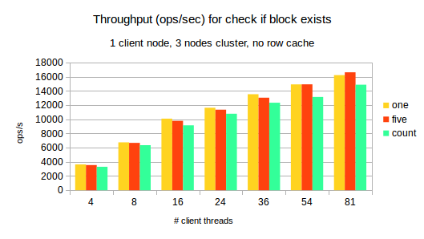
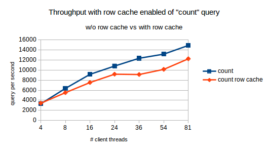

# How to query Cassandra if the block exists?

Essential query for deduplication is check, if particular block exists (is present in the storage).
To check which of the approaches can do better I decided to go with `cassandra-stress` in user mode.

There is a [good post](http://www.datastax.com/dev/blog/improved-cassandra-2-1-stress-tool-benchmark-any-schema) how to use it and very good video from Cassandra Summit 2016 [here](https://youtu.be/it4yqHXu4TE?list=PLm-EPIkBI3YoiA-02vufoEj4CgYvIQgIk).

Please notice latency == 95th percentile

## Questions to be answered

1. Should I query `blocks` directly or use `existing_blocks`?
2. Which approach should I take for querying existing_blocks table?
3. Should I use row cache?

## cassandra-stress

Cassandra stress let you test in fact one table at a time. So I decided to test `existing_blocks` table. In original CASStor approach it has only primary key and is used as a distributed set. Unfortunately `cassandra-stress` will fail with so simple table as it requires at least one non-pk column to be present.

## Should I query `blocks` directly or use `existing_blocks`?

This is a tradeoff between additional writes, keeping same information in 2 places and scalability. I used [this yaml] (/stress/stress.blocks.yaml) to test using `cassandra-stress`. 

Green bars from
```
select block_hash from existing_blocks where block_hash=?
```
while red ones from
```
select block_hash, block_size from existing_blocks where block_hash=?
```


From the plots below I would say none of the approaches on `blocks` table scales well:


While it scales better with `existing_blocks`:


## Which approach should I take for querying existing_blocks table?

My stress.existing_blocks.yaml file:
```yaml
keyspace: casstor_meta

table: existing_blocks_2

table_definition: |
    CREATE TABLE casstor_meta.existing_blocks_2 (
    block_hash text PRIMARY KEY, block_size int)

columnspec:
  - name: block_hash
    size: fixed(32)
  - name: block_size
    size: uniform(8192..262200)

insert:
    partitions: fixed(1)

queries:
    exists_one:
        cql: select block_hash, block_size from existing_blocks_2 where block_hash = ? limit 1

    exists_five:
        cql: select block_hash, block_size from existing_blocks_2 where block_hash in (?,?,?,?,?) limit 5

    exists_count:
        cql: select count(*) from existing_blocks_2 where block_hash = ? limit 1
```

As you see I consider three different approaches to check if block exists.

So I loaded 10G of block_hashes and measure latency and throughput (ops/s) with increased number of client threads.




Plots confirm that with so many blocks to check during single write operation (around 10k for 1G file) it is reasonable to put N hashes in one query. Presented results are with 5 queries which means that basically we get around 4.6 x better throughput no "five" approach with no penalty on 95perc latency.


## Should I use row cache for existing_blocks?

Row cache has to be enabled in the cassandra.yaml. Unfortunately `nodetool setcachecapacity` can change the size but will not enable row cache if it is set to 0 in the cassandra.yaml file.

To enable row cache for a table:
```
alter table casstor_meta.existing_blocks_2 with caching = {'keys':'ALL', 'rows_per_partition':'ALL'};
```

`cassandra-stress` will generate completely random data and then will also query them using random data. In fact the hit ratio for the row cache was not more than 15%. In such situation using row_cache seem to be unnecessary or even harmfull as it seem to have scalability problems with increased number of clients:




## Summary

As expected from the scalability performance it is a good idea to have separate lightweight table with block hashes, as it's memtables and sstables can handle much more partitions than blocks with binary content of siginificant size.

It is also a good idea to ask for multiple hashes in one query. It does not decrease throughput nor latency and the boilerplate of cql query is minimized.

## Links

* http://www.sestevez.com/sestevez/CassandraDataModeler/
* https://tobert.github.io/pages/als-cassandra-21-tuning-guide.html
